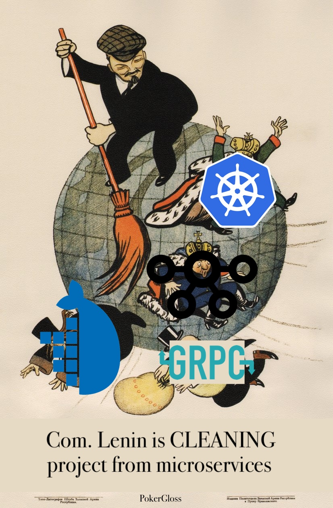

# PokerGloss  
Back-end Monolith of [PokerGloss.com](https://PokerGloss.com). [Front-end repo](https://github.com/glossd/pokergloss-ui)

TL;DR Microservices are great if you have money.  

I love Docker, Kafka and all that cloud stuff, just don't have enough money:)

## A bit of history
Each folder in this repository used be either a library or a microservice having it's own
Grpc API, Rest API, CI/CD and Kubernetes config. Everything was deployed to GKE.   
I **shut down** the project in **2021** because I was low on funds and burned out.
## Revival
I always wanted to keep it online but the cost of GKE would prevent that.  
In **2024** I felt positive enough to fix it. My goal was to run it as cheap as possible (under 10$ a month). 
That means **no** Kubernetes, Docker, gRPC, Message Queues and the whole Microservice Architecture.
I decided to merge all microservices into a monolith and deploy it as a single Go binary to a VPS instance.
### Rebranding
The original project's name was PokerBlow. I knew it was a bit cheeky, but then too many people pointed out that it sounds sexual.
After the migration from the cloud, I renamed it to PokerGloss as pokergloss.com was available and it sounds good to me!
### From Microservices to Monolith changes
1. Thanks to `api/{service_name}/**` pattern it was easy to combine all the routes in one HTTP server.  
2. gRPC was replaced with simple function calls. I'm glad I decided to create gRPC only for internal calls, instead of having the easy gRPC-HTTP transcoding way. 
3. Pub/Sub was replaced with simple Go channels, ([I used this to mock it](https://github.com/glossd/memmq/blob/master/memmq.go)). 
I'm glad GCP didn't offer Kafka as a Service because it would be harder to get rid of. However, table timeouts needed to be persistent and I kept Pub/Sub just for them.   
4. Each service would still have its own database, because it creates no additional costs.
5. I deleted all the k8s yaml files, because now the result product of the whole back-end is just a binary running behind nginx on a small VPS.
6. The microservices used to run on Golang 1.15. Some of the old packages were no longer available e.g. `google.golang.org/grpc`
So I had to reinstall packages, updating Go to 1.23.
7. I had a nice CI/CD pipeline test->build->deploy->build_client-publish-client for each service.
But remembering how much pain it was to configure [dockertest](https://github.com/ory/dockertest) for GitLab (the last lines of readme are mine),
I decided to stick with local bash scripts and run tests on my M3 macbook, which is a lot faster than any ci runner. Maybe later I'll add the GitHub CI/CD.

### License
I have used the MongoDB license because I don't want anyone using this commercially without my permission. 
If you'd like to use something from this project commercially please email me at dennisgloss23@gmail.com  